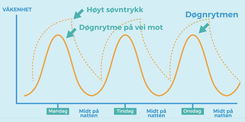
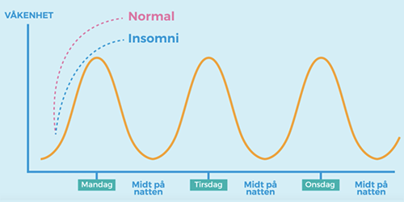
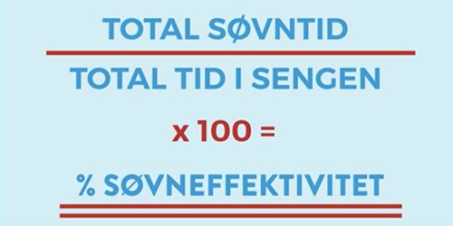
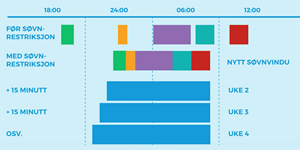

# Modul 3: Søvnrestriksjon

[HOME](../README.md)

## Bagkgrunn
Hvorfor må vi sove:
* døgnrytme: vår indre 24 timers klokke som styrer opplevd våkenhet. Den ble styrt av lys, aktivitet, vaner og sosiale faktorer. 
* søvntrykk / søvnbehov: Egenskap av vår indre klokke. Det trenger ikke å være 8 timer. Både lengden og kvaliteten er avgjørende. Man får nok søvn dersom man føler seg tilstrekkelig uhvilt på dagtid. Søvntrykket bygges det opp over tid mens man er våken (som å være tørst). Søvntrykket rdusere ved nattesøvn. Optimal leggetid er når søvntrykket er høyt samtidig som at personens døgnrytme er på vei mot natt.

Insomnia betyr at begge prosessene er usynkronisert. 

|||
|:-:|:-:|
|||
|Søvntrykk og døgnrytme|Normal søvntrykk og insomnia|

## Søvnrestriksjon

Søvnretriksjone skal bygge opp et kraftig søvntrykk. Det handler om å være streng og å kun tillat seg til å sove under noen omstendigheter. Hvis man sover veldig uregelmessig, vil man samle inn tiden man sover til et søvnvindu som er på natten.

Søvnrestriksjon skal gi bedre søvneffektivitet (cf. nedenfor). Søvneffektivitet på  85 % er normal, under kan man fort blir frustrert og mer våken.

## Ditt nye søvnvindu
* Se på din søvndagbok. 
* Ta utgangspunkt i gjennomsnittlige søvntid gjennom hele uken som ditt nye søvnvindu.
* Finn et passende tidspunkt for å legge deg og for å stå opp. 
* Gjør en avtale med deg selv og finn ditt legge- og oppvåkningstidspunkt.
* Tenk på strategier som kan hjelpe deg til å stå opp (venner, dusj, kaffe, kjæreste, osv.).
* Hold det hver dag i ei minimum ei uke, også på helgen.
* Etter ei uke: Dersom søvneffektiviteten vanligvis er over 80%, juster vinduet opp med 15 minutter per uke ved å legge til 15 minutter _per uke_.
* Stopp oppjusteringen når søvneffektivitet er mer enn 85 % og man sover godt gjennom natten. (Det kan ta noen uker eller måneder.)

|||
|:-:|:-:|
|||
|Søvneffektivitet|Ditt nye søvnvindu|

OBS!:
* Følg med gjennom søvndagboka. 
* Dersom du _ikke_ får nok søvneffektivitet i løpet av 1-2 uker, må du nedjustere søvnvinduet ditt.
* Velg helst et søvnvindu som er mer enn fem timer.
* Det kan hende at man sover mindre enn vanlig de første dagene. Det er normal siden kroppen må tilpasse seg.
* Ikke sov på dagen. Du skal kun sove i søvnvinduet.
* Hvis du ikker er sikker på om du kan gjennomføre dette i praksis, er dette ikke programmet for deg.
